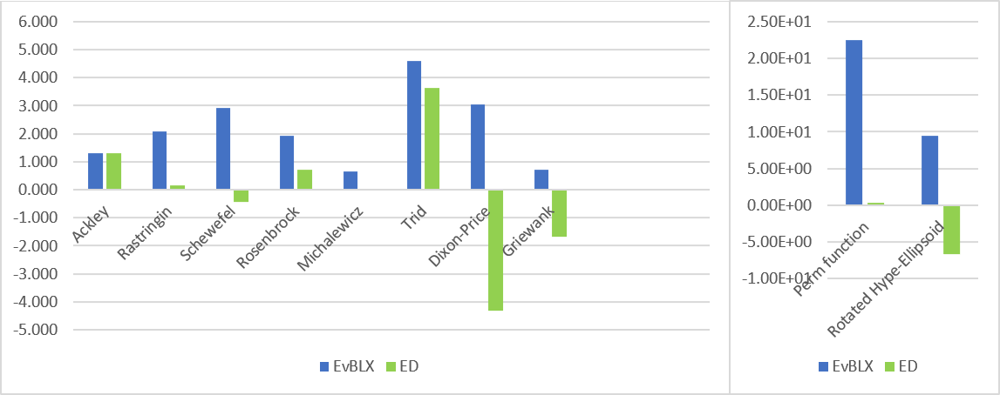
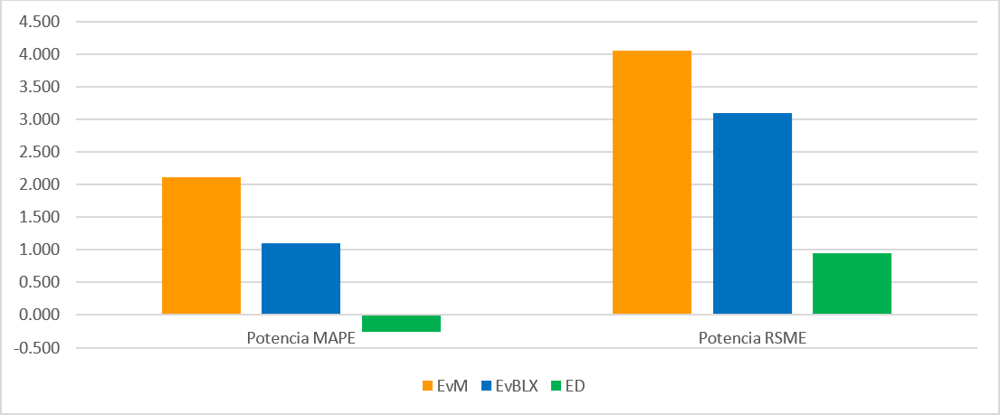

# Algoritmos Genéticos
Español- 🇪🇸
· [Algoritmos Genéticos](#algoritmos-genéticos)
   · [Funciones a optimizar](#funciones-a-optimizar)
   · [Algoritmos usados](#algoritmos-usados)
	   · [Algoritmo Evolutivo](#algoritmo-evolutivo)
      · [Algoritmo Diferencial](#algoritmo-diferencial)
   · [Resultados obtenidos](#resultados-obtenidos)
   · [Ejecución](#ejecución)

English - 🇺🇸
· [Genetic Algorithms](#genetic-algorithms)
   · [Functions to Optimize](#functions-to-optimize)
   · [Algorithms Used](#algorithms-used)
      · [Evolutionary Algorithm](#evolutionary-algorithm)
      · [Differential Algorithm](#differential-algorithm)
   · [Obtained Results](#obtained-results)
   · [Execution](#execution)

Este proyecto trata de estudiar el funcionamiento de metaheurísticas basadas en poblaciones desarrollando un Algoritmo Evolutivo y un Algoritmo de Evolución Diferencial para la optimización de una serie de funciones.

## Funciones a optimizar
Se han seleccionado las siguientes [funciones](https://www.sfu.ca/~ssurjano/optimization.html) que suelen ser usadas para probar algoritmos de optimización ya que cuentan con una gran cantidad de mínimos locales:

| Función                     | Mínimo    | Máximo    | Óptimo    | Función objetivo |
|-----------------------------|-----------|-----------|-----------|------------------|
| Ackley                      | -32768    | 32768     | 0         | $$ f(x, y) = -20 exp\left(-0.2 \sqrt{0.5(x^2 + y^2)}\right) - exp\left(0.5(cos(2\pi x) + cos(2\pi y))\right) + e + 20 $$ |
| Rastringin                  | -51.12    | 51.12     | 0         | $$ f(x) = An + \sum_{i=1}^{n} \left[x_i^2 - A cos(2\pi x_i)\right] $$ |
| Schewefel                   | -500      | 500       | 0         | $$ f(x) = 418.9829d - \sum_{i=1}^{d} x_i \sin(\sqrt{abs[x_1]}) $$ |
| Perm Function               | -100      | 100       | 0         | $$ f(x) = \sum_{i=1}^{d} \left( \sum_{j=1}^{d} (j^i + \beta) \left( \left( \frac{x_j}{j} \right)^i - 1 \right) \right)^2 $$ |
| Rotated Hyper-Ellipsoid     | -65536    | 65536     | 0         | $$ f(x) = \sum_{i=1}^{d} \sum_{j=1}^{i} x_j^2 $$ |
| Rosenbrock                  | -5        | 10        | 0         | $$ f(x, y) = (a - x)^2 + b(y - x^2)^2 $$ |
| Michalewicz                 | 0         | 2π        | -9.66015  | $$ f(x) = - \sum_{i=1}^{d} sin(x_i)sin^{2m}\left(\frac{i x_i^2}{\pi}\right) $$ |
| Trid                        | -1000     | 1000      | -200      | $$ f(x) = \sum_{i=1}^{d} (x_i - 1)^2 - \sum_{i=2}^{d} x_i x_{i-1} $$ |
| Dixon-price                 | -100      | 100       | 0         | $$ f(x) = (x_1 - 1)^2 + \sum_{i=2}^{d} i (2x_i^2 - x_{i-1})^2 $$ |
| Griewank                    | -1000     | 1000      | 0         | $$ f(x) = \sum_{i=1}^{d} \frac{x_i^2}{4000} - \prod_{i=1}^{d} cos\left(\frac{x_i}{\sqrt{i}}\right) + 1 $$ |
| Potencia                    | -1        | 1         | No tiene  | $$ P_m = DNI(a_1 + a_2 DNI + a_3 T_A + a_4 W_s + a_5 SMR) $$ |

En todas las funciones se trata de llegar a su resultado más óptimo, a excepción de la función Potencia. En el caso de la función *Potencia*, esta trata de representar la potencia real generada por un módulo considerando la irradiancia, viento ambiental y SMR, dónde encontramos los siguientes parámetros:

- PM (W): maximum power.
- DNI (W/m^2): direct normal irradiance.
- TA (°C): ambient temperature.
- WS (m/s): wind speed.

El algoritmo tiene que ajustar los valores a1, a2, a3, a4 y a5 para reducir el error de un conjunto de observaciones, y cada valor estará formado por valores en el intervalo [-1, 1]. Hay que calcular el error respecto a un conjunto de observaciones.

Observación

DNI | APE | Temperatura | Velocidad viento | SMR | G | Potencia
--- | --- | --- | --- | --- | --- | ---
0.45 | 0.23 | 0.34 | 23.1 | 4.3 | 0.12 | 12
... | ... | ... | ... | ... | ... | ...
0.23 | 0.34 | 0.54 | 21.4 | 3.6 | 0.11 | 34

De todas las columnas descartamos APE y G porque no se utilizan en esta fórmula, y tenemos que calcular el fitness de un individuo mediante la función de evaluación para todas las muestras con MAPE y RMSE. El objetivo es minimizar el resultado.

## Algoritmos usados
### Algoritmo Evolutivo
Se creará una generación inicial a partir de una semilla. Acto seguido esa población entraría en un bucle definido por una condición de parada ligada a un número de evaluaciones que se deberían llevar a cabo para terminar dicho bucle, una evaluación se produce cuando un individuo nace por cruce o por mutación.

Seguidamente se producirá la creación de una nueva generación, la cual se divide en dos pasos, la selección de los padres y el proceso de cruce o mutación. En el caso de los padres se produce un torneo de tamaño k de candidatos para elegir al primero y luego otro torneo con las mismas condiciones para elegir al segundo, en caso de que ambos sean iguales, repetiremos ese torneo para el segundo padre hasta que estos sean diferentes.

Por otra parte, en el algoritmo de cruce, veremos si se cumple la condición de cruce, en tal caso realizaremos un cruce con el genotipo de los padres para crear así un individuo nuevo, en caso de especificar un cruce con la media se realizará una media con el genotipo de los padres o si se ha elegido un cruce BLk, se realizará un cruce de tipo BLk. En caso de no realizar cruce, se introduce un miembro de la población anterior directamente como individuo nuevo.

Finalmente se mirará si se cumple la condición de mutación para cada individuo y en caso de que esta se cumpla, se modifica el gen del individuo. En cualquiera de los casos, mutación o cruce se cuenta como una evaluación más.

Por último, en el reemplazo, se realizará primero una búsqueda de la antigua mejor élite del individuo para conservarla y saber cuál era, acto seguido se produce el reemplazamiento de la

antigua generación, por la nueva y finalmente, se buscará si la antigua mejor elite a sobrevivido en la nueva, en tal caso no tendremos problemas, en caso contrario se realizará un torneo de Kelite individuos en el que elegiremos aquel con peor fitness para reemplazarlo por la élite de la antigua mejor solución.

### Algoritmo Diferencial
Este algoritmo tiene una base idéntica al de los algoritmos evolutivos, pero con ciertas diferencias, carecemos de una variable que nos indique la élite y el cruce lo hacemos por el operador de recombinación ternaria para hacer lo que denominamos “cruce” en el algoritmo evolutivo.

El proceso para la creación de este algoritmo es el siguiente, primero se lleva a cabo una selección de cuatro padres, uno de ellos por torneo, dos se harán de forma completamente aleatoria y el último padre será aquel que pertenece a una posición específica de la población y es el que se tendrá que reemplazar por el hijo generado, si ninguno de los cuatro padres coincide pasaremos a la creación del individuo hijo. Para ello utilizaremos un aleatorio para cada alelo, si se cumple la condición sustituiremos ese dato por un alelo creado a partir del operador de recombinación ternaria, en caso contrario se sustituirá por el alelo del padre por el que deberá sustituirse.

En cuanto a la sustitución por la nueva generación cumple una regla muy sencilla si el hijo es mejor que el padre del que se ha generado, este se sustituye. Por último en cuanto a la condición de parada, al igual que en el evolutivo depende de las evaluaciones, las cuales se realizan siempre que se crea un individuo nuevo.

Para la elección aleatoria de dos individuos se ha utilizado un **operador ternario** el cual se basa en la elección aleatoria de los dos aleatorios, y la aplicación de un torneo con k=3 para el individuo objetivo. Este operador se aplicará tantas veces como individuos tengamos en la población para generar una población completamente nueva de forma que el individuo padre será elegido de forma secuencial para que todos sean padres en cada generación. Una vez tengamos seleccionados el individuo objetivo, padre y los dos aleatorios se aplica la fórmula del Vector 1-diferencia para cada valor de las dimensiones obteniendo un individuo nuevo.
$$ \text{Ind}_{nuevo} = \text{Ind}_{padre} + F(\text{Ind}_1 - \text{Ind}_2) $$
Siendo F el factor de mutación. Por otro lado, el individuo nuevo se recombina con igual probabilidad con el individuo objetivo para todas las dimensiones (j) del vector.
$$ \text{Ind}_{nuevo}[j] = 
\begin{cases} 
\text{Ind}_{nuevo}[j] & \text{si aleatorio} \leq 0.5 \\
\text{Ind}_{obj}[j] & \text{en otro caso} 
\end{cases} $$

## Resultados obtenidos
● EvM     -> Evolutivo con cruce BLX-Media.
● EvBLX -> Evolutivo con cruce BLX-ALFA con alfa=0.5.
● ED ->       Evolución diferencial

|                 | Ackley   | Rastrigin | Schwefel | Perm function | Rotated Hype-Ellipsoid | Rosenbrock | Michalewicz | Trid      | Dixon-Price | Griewank  |
|-----------------|----------|-----------|----------|---------------|------------------------|------------|-------------|-----------|-------------|-----------|
| **EvM**         | 20.523   | 1839.013  | 0.232    | 6.32E+29      | 5.53E+09               | 3128.937    | -4.609      | 77525.874 | 35331.732   | 185.260   |
| **EvBLX**       | 20.412   | 124.682   | 848.287  | 3.12E+22      | 2.87E+09               | 83.880     | -5.225      | 39536.822 | 1072.727    | 5.230     |
| **ED**          | 20.005   | 1.393     | -0.375   | 2.26E+00      | 2.54E-07               | 5.117      | -8.563      | 4336.149  | 0.000       | 0.022     |
| **Valor Óptimo**| 0        | 0         | 0        | 0             | 0                      | 0          | -9.66       | -200      | 0           | 0         |

Respecto a los resultados (en escala logarítmica para poder ser representados correctamente) del error obtenido en la función Potencia:

## Ejecución
Para su ejecución se puede ejecutar el archivo Practica2.jar mediante:

    java -jar Practica2.jar daido-tra.dat config0.txt
O se puede ejecutar el archivo *ejecutar.bat* para que lo haga directamente,.

Los resultados se mostrarán dentro de la carpeta log después de cada ejecución. Cada archivo de resultados generado mostrará un historial de las evoluciones realizadas, asi como los mejores resultados al final del archivo.

- Archivos config: Son los archivos de configuración para indicar los distintos parámetros de ejecución.
  Se ha dividido en 3 archivos config para diferenciar cada ejecución.
  Config0 --> Ejecuta EvM y EvBLX para todas las funciones
  Config1 --> Ejecuta ED para todas las funciones
  Config2 --> Ejecuta la funcion potencia para todos los algoritmos
 
  Cabría la posibilidad de dejar tan solo un archivo config que ejecutase todo lo anterior a la vez.

  Los nombres de los algoritmos son: "AlgoritmoEvolutivo"  "AlgoritmoDiferencial".
  En BLK_ALFA poner "true" para que cuando se ejecute el algoritmo evolutivo lo haga con cruce
  blx-alfa o poner "false" para que lo haga con cruce blx-media

# Genetic Algorithms

This project aims to study the functioning of population-based metaheuristics by developing an Evolutionary Algorithm and a Differential Evolution Algorithm for the optimization of a series of functions.

## Functions to Optimize
The following [functions](https://www.sfu.ca/~ssurjano/optimization.html) have been selected, which are commonly used to test optimization algorithms as they have a large number of local minima:

| Function                    | Minimum   | Maximum   | Optimum   | Objective Function |
|-----------------------------|-----------|-----------|-----------|--------------------|
| Ackley                      | -32768    | 32768     | 0         | $$ f(x, y) = -20 exp\left(-0.2 \sqrt{0.5(x^2 + y^2)}\right) - exp\left(0.5(cos(2\pi x) + cos(2\pi y))\right) + e + 20 $$ |
| Rastringin                  | -51.12    | 51.12     | 0         | $$ f(x) = An + \sum_{i=1}^{n} \left[x_i^2 - A cos(2\pi x_i)\right] $$ |
| Schewefel                   | -500      | 500       | 0         | $$ f(x) = 418.9829d - \sum_{i=1}^{d} x_i \sin(\sqrt{abs[x_1]}) $$ |
| Perm Function               | -100      | 100       | 0         | $$ f(x) = \sum_{i=1}^{d} \left( \sum_{j=1}^{d} (j^i + \beta) \left( \left( \frac{x_j}{j} \right)^i - 1 \right) \right)^2 $$ |
| Rotated Hyper-Ellipsoid     | -65536    | 65536     | 0         | $$ f(x) = \sum_{i=1}^{d} \sum_{j=1}^{i} x_j^2 $$ |
| Rosenbrock                  | -5        | 10        | 0         | $$ f(x, y) = (a - x)^2 + b(y - x^2)^2 $$ |
| Michalewicz                 | 0         | 2π        | -9.66015  | $$ f(x) = - \sum_{i=1}^{d} sin(x_i)sin^{2m}\left(\frac{i x_i^2}{\pi}\right) $$ |
| Trid                        | -1000     | 1000      | -200      | $$ f(x) = \sum_{i=1}^{d} (x_i - 1)^2 - \sum_{i=2}^{d} x_i x_{i-1} $$ |
| Dixon-price                 | -100      | 100       | 0         | $$ f(x) = (x_1 - 1)^2 + \sum_{i=2}^{d} i (2x_i^2 - x_{i-1})^2 $$ |
| Griewank                    | -1000     | 1000      | 0         | $$ f(x) = \sum_{i=1}^{d} \frac{x_i^2}{4000} - \prod_{i=1}^{d} cos\left(\frac{x_i}{\sqrt{i}}\right) + 1 $$ |
| Power                       | -1        | 1         | No Optimum| $$ P_m = DNI(a_1 + a_2 DNI + a_3 T_A + a_4 W_s + a_5 SMR) $$ |

For all functions, the goal is to achieve the most optimal result, except for the Power function. The *Power* function aims to represent the actual power generated by a module considering irradiance, ambient wind, and SMR, where the following parameters are found:

- PM (W): maximum power.
- DNI (W/m^2): direct normal irradiance.
- TA (°C): ambient temperature.
- WS (m/s): wind speed.

The algorithm must adjust the values of a1, a2, a3, a4, and a5 to reduce the error of a set of observations, and each value will be formed by values in the range [-1, 1]. The error must be calculated with respect to a set of observations.

Observation

DNI | APE | Temperature | Wind Speed | SMR | G | Power
--- | --- | --- | --- | --- | --- | ---
0.45 | 0.23 | 0.34 | 23.1 | 4.3 | 0.12 | 12
... | ... | ... | ... | ... | ... | ...
0.23 | 0.34 | 0.54 | 21.4 | 3.6 | 0.11 | 34

From all columns, APE and G are discarded because they are not used in this formula. The fitness of an individual must be calculated using the evaluation function for all samples with MAPE and RMSE. The goal is to minimize the result.

## Algorithms Used
### Evolutionary Algorithm
An initial generation will be created from a seed. Then this population will enter a loop defined by a stop condition linked to a number of evaluations that should be carried out to end the loop, an evaluation occurs when an individual is born by crossing or mutation.

Then, the creation of a new generation will occur, which is divided into two steps: the selection of parents and the process of crossing or mutation. In the case of parents, a tournament of size k of candidates is held to choose the first one and then another tournament with the same conditions to choose the second. If both are the same, we will repeat that tournament for the second parent until they are different.

On the other hand, in the crossover algorithm, we will see if the crossover condition is met, in which case we will perform a crossover with the genotype of the parents to create a new individual. If a crossover with the average is specified, an average with the genotype of the parents will be performed, or if a BLk crossover has been chosen, a BLk type crossover will be performed. If no crossover is performed, a member of the previous population is directly introduced as a new individual.

Finally, it will be checked if the mutation condition is met for each individual and if so, the gene of the individual will be modified. In any case, mutation or crossover counts as one more evaluation.

Lastly, in the replacement, a search for the old best elite of the individual will be carried out first to preserve it and know what it was, then the replacement of the

old generation, by the new one and finally, it will be checked if the old best elite has survived in the new one, in that case, there will be no problems, otherwise, a tournament of Kelite individuals will be held in which we will choose the one with the worst fitness to replace it by the elite of the old best solution.

### Differential Algorithm
This algorithm has a base identical to that of evolutionary algorithms, but with certain differences. We lack a variable that indicates the elite, and the crossover is done by the ternary recombination operator to do what we call "crossover" in the evolutionary algorithm.

The process for the creation of this algorithm is as follows, first a selection of four parents is carried out, one of them by tournament, two will be made completely randomly and the last parent will be the one that belongs to a specific position of the population and is the one that has to be replaced by the generated child, if none of the four parents coincide we will proceed to the creation of the child. For this, we will use a random for each allele, if the condition is met we will replace that data with an allele created from the ternary recombination operator, otherwise, it will be replaced by the allele of the parent by which it must be replaced.

As for the substitution by the new generation, it complies with a very simple rule if the child is better than the parent from which it has been generated, it is replaced. Finally, as for the stop condition, like in the evolutionary, it depends on the evaluations, which are always carried out whenever a new individual is created.

For the random choice of two individuals, a **ternary operator** has been used which is based on the random choice of the two randoms, and the application of a tournament with k=3 for the target individual. This operator will be applied as many times as individuals we have in the population to generate a completely new population so that the parent individual will be chosen sequentially so that all are parents in each generation. Once we have selected the target individual, parent and the two randoms, the formula of the 1-difference Vector is applied for each value of the dimensions obtaining a new individual.
$$ \text{Ind}_{new} = \text{Ind}_{parent} + F(\text{Ind}_1 - \text{Ind}_2) $$
Being F the mutation factor. On the other hand, the new individual is recombined with equal probability with the target individual for all dimensions (j) of the vector.
$$ \text{Ind}_{new}[j] = 
\begin{cases} 
\text{Ind}_{new}[j] & \text{if random} \leq 0.5 \\
\text{Ind}_{target}[j] & \text{in another case} 
\end{cases} $$

## Obtained Results
● EvM     -> Evolutionary with BLX-Average crossover.
● EvBLX -> Evolutionary with BLX-ALFA crossover with alpha=0.5.
● ED ->       Differential Evolution

|                 | Ackley   | Rastrigin | Schwefel | Perm function | Rotated Hype-Ellipsoid | Rosenbrock | Michalewicz | Trid      | Dixon-Price | Griewank  |
|-----------------|----------|-----------|----------|---------------|------------------------|------------|-------------|-----------|-------------|-----------|
| **EvM**         | 20.523   | 1839.013  | 0.232    | 6.32E+29      | 5.53E+09               | 3128.937   | -4.609      | 77525.874 | 35331.732   | 185.260   |
| **EvBLX**       | 20.412   | 124.682   | 848.287  | 3.12E+22      | 2.87E+09               | 83.880     | -5.225      | 39536.822 | 1072.727    | 5.230     |
| **ED**          | 20.005   | 1.393     | -0.375   | 2.26E+00      | 2.54E-07               | 5.117      | -8.563      | 4336.149  | 0.000       | 0.022     |
| **Optimum Value**| 0        | 0         | 0        | 0             | 0                      | 0          | -9.66       | -200      | 0           | 0         |

Regarding the results (in logarithmic scale to be correctly represented) of the error obtained in the Power function:

## Execution
For its execution, the Practica2.jar file can be run using:

    java -jar Practica2.jar daido-tra.dat config0.txt
Or the *ejecutar.bat* file can be run to do it directly.

The results will be shown inside the log folder after each execution. Each result file generated will show a history of the evolutions carried out, as well as the best results at the end of the file.

- Config files: These are configuration files to indicate the different execution parameters.
  It has been divided into 3 config files to differentiate each execution.
  Config0 --> Executes EvM and EvBLX for all functions
  Config1 --> Executes ED for all functions
  Config2 --> Executes the power function for all algorithms
 
  It would be possible to leave only one config file that would execute everything mentioned above at once.

  The names of the algorithms are: "EvolutionaryAlgorithm" "DifferentialAlgorithm".
  In BLK_ALFA put "true" so that when the evolutionary algorithm is executed it does so with blx-alfa crossover or put "false" for it to do so with blx-average crossover.

